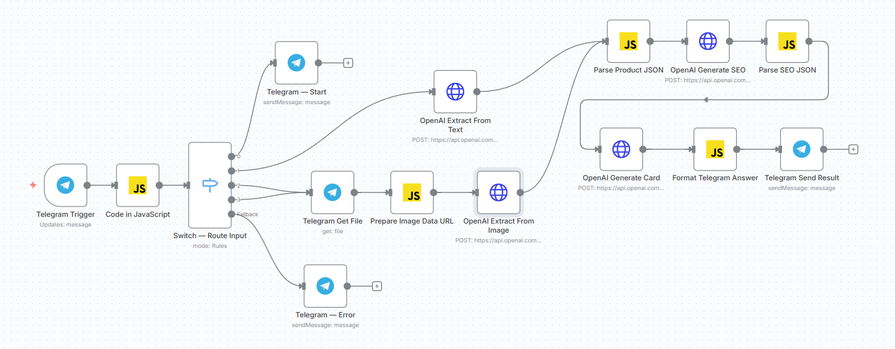
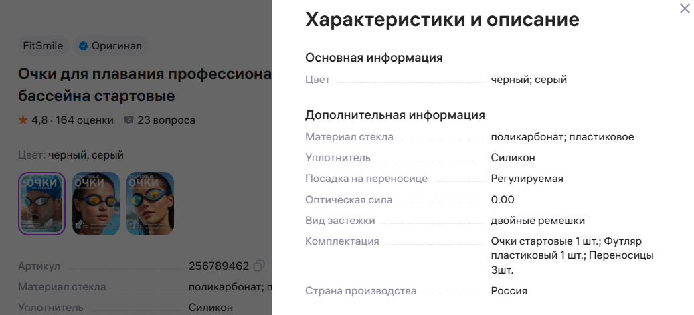

````md
# Wildberries Product Description Bot

Telegram-бот на **n8n** для генерации SEO-контента карточек товаров Wildberries.

Бот принимает название товара, характеристики или скриншот карточки/характеристик, извлекает фактические данные о товаре и формирует:

- SEO-ключи по группам;
- рекомендованное наименование для карточки;
- описание товара;
- список преимуществ;
- список данных, которые желательно уточнить перед публикацией.

Проект сделан как MVP для демонстрации AI-автоматизации работы с карточками маркетплейса.

---

## Что умеет бот

### Входные данные

Бот поддерживает несколько сценариев:

1. **Текстовое название товара**

```text
Очки для плавания профессиональные для бассейна стартовые
````

2. **Название + характеристики**

```text
Очки для плавания профессиональные для бассейна стартовые FitSmile.

Материал стекла: поликарбонат.
Уплотнитель: силикон.
Посадка на переносице: регулируемая.
Оптическая сила: 0.00.
Вид застежки: двойные ремешки.
Комплектация: очки стартовые 1 шт., футляр пластиковый 1 шт., переносицы 3 шт.
Цвет: черный, серый.
```

3. **Скриншот карточки или характеристик**

Бот может принять изображение, извлечь с него название, характеристики, артикул и комплектацию, если они видны на скриншоте.

4. **Картинка с подписью**

Если пользователь отправляет скриншот и подпись к нему, бот использует оба источника: изображение и текст подписи.

---

## Что бот возвращает

Ответ в Telegram формируется в структурированном виде:

* найденные данные товара;
* артикул;
* характеристики;
* цвет;
* материалы;
* комплектация;
* SEO-ключи;
* наименование для карточки;
* описание товара;
* преимущества;
* недостающие данные;
* использованные ключи.

---

## Пример workflow в n8n



---

## Пример входного изображения

Пользователь отправляет скриншот блока характеристик товара:



---

## Общая логика workflow

```text
Telegram Trigger
↓
Normalize Telegram Update
↓
Switch — Route Input
├─ /start или /help → Telegram Start Message
├─ text → OpenAI Extract From Text
├─ image → Telegram Get File → Prepare Image Data URL → OpenAI Extract From Image
├─ image_with_caption → Telegram Get File → Prepare Image Data URL → OpenAI Extract From Image
└─ fallback → Unsupported Input Message

После извлечения данных:

Parse Product JSON
↓
OpenAI Generate SEO
↓
Parse SEO JSON
↓
OpenAI Generate Card
↓
Format Telegram Answer
↓
Telegram Send Result
```

---

## Основные ноды

### `Telegram Trigger`

Принимает входящие сообщения от пользователя.

Поддерживает:

* текст;
* фото;
* фото с подписью;
* команды `/start` и `/help`.

### `Normalize Telegram Update`

Code-нода, которая приводит Telegram update к единому формату и определяет тип входа:

```text
start
text
image
image_with_caption
unknown
```

### `Switch — Route Input`

Разводит входящие сообщения по веткам:

* стартовое сообщение;
* текстовая обработка;
* обработка изображения;
* fallback для неподдерживаемых форматов.

### `OpenAI Extract From Text`

Извлекает фактические данные товара из текстового сообщения.

Пример структуры результата:

```json
{
  "brand": "",
  "product_name_raw": "",
  "category": "",
  "product_type": "",
  "functional_purpose": "",
  "colors": [],
  "materials": [],
  "characteristics": {},
  "package_contents": [],
  "target_audience": [],
  "use_cases": [],
  "detected_benefits": [],
  "missing_important_data": [],
  "clarifying_questions": []
}
```

### `Telegram Get File`

Получает файл изображения из Telegram по `photo_file_id`.

### `Prepare Image Data URL`

Готовит изображение для OpenAI Vision.

Так как n8n работает в self-hosted режиме с `binaryDataMode=filesystem`, бинарные данные читаются через:

```javascript
this.helpers.getBinaryDataBuffer()
```

Затем изображение переводится в base64 data URL:

```text
data:image/jpeg;base64,...
```

### `OpenAI Extract From Image`

Анализирует скриншот карточки или блока характеристик.

Извлекает:

* бренд;
* исходное наименование;
* категорию;
* тип товара;
* назначение;
* цвета;
* материалы;
* характеристики;
* комплектацию;
* артикул;
* плохо читаемые или недостающие данные.

### `OpenAI Generate SEO`

Формирует SEO-ключи по группам:

```json
{
  "high_frequency_keywords": [],
  "middle_frequency_keywords": [],
  "long_tail_keywords": [],
  "attribute_keywords": [],
  "avoid_keywords": []
}
```

Группировка по частотности в MVP логическая. Реальная частотность запросов WB не используется.

### `OpenAI Generate Card`

Генерирует итоговый контент карточки:

* наименование;
* описание;
* преимущества;
* использованные ключи.

В текущей версии для этой ноды можно использовать более сильную модель, так как именно она отвечает за качество итогового текста.

### `Format Telegram Answer`

Формирует финальное сообщение для Telegram.

### `Telegram Send Result`

Отправляет результат пользователю. Служебная подпись n8n отключена.

---

## Fallback-ветка

Если пользователь отправляет неподдерживаемый формат, например файл, документ, голосовое сообщение, видео или стикер, бот возвращает подсказку:

```text
Не понял формат сообщения.

Отправьте один из вариантов:
1. название товара текстом;
2. название + характеристики текстом;
3. скриншот карточки или характеристик как фото.

Важно: скриншот отправляйте именно как фото, не как файл.
```

---

## Пример результата

Для скриншота с товаром FitSmile бот извлекает данные и формирует ответ вида:

```text
Готово.

Найденные данные товара:
Бренд: FitSmile
Исходное название: Очки для плавания профессиональные бассейна стартовые
Категория: Очки для плавания
Тип товара: Стартовые очки
Назначение: Плавание
Артикул: 256789462

Характеристики:
• цвет: черный; серый
• материал стекла: поликарбонат; пластиковое
• уплотнитель: Силикон
• посадка на переносице: Регулируемая
• оптическая сила: 0.00
• вид застежки: двойные ремешки
• страна производства: Россия

Цвет:
• черный
• серый

Материалы:
• поликарбонат
• пластиковое стекло
• силикон

Комплектация:
• Очки стартовые 1 шт.
• Футляр пластиковый 1 шт.
• Переносицы 3 шт.

SEO-ключи

Высокочастотные:
• очки для плавания
• плавательные очки
• спортивные очки для плавания

Среднечастотные:
• стартовые очки для плавания
• очки для бассейна
• профессиональные очки для плавания

Наименование для карточки:
Очки для плавания стартовые FitSmile

Описание:
Стартовые очки для плавания FitSmile подходят для тренировок и занятий в бассейне...
```

---

## Что реализовано

* Telegram-бот;
* обработка `/start` и `/help`;
* обработка текстового ввода;
* обработка скриншота как фото;
* обработка картинки с подписью;
* fallback для неподдерживаемых форматов;
* извлечение данных товара из текста;
* извлечение данных товара из изображения;
* генерация SEO-ключей;
* группировка SEO-ключей;
* генерация наименования;
* генерация описания;
* генерация преимуществ;
* вывод недостающих данных.

---

## Что пока не реализовано

* генерация фото товара;
* редактирование исходного фото;
* автоматическая публикация в Wildberries;
* подключение WB API;
* сохранение истории в БД;
* отдельная оценка качества наименования;
* анализ конкурентов;
* анализ отзывов и вопросов покупателей;
* точная SEO-частотность по данным маркетплейса.

---

## Ограничения MVP

Бот генерирует черновик контента, а не финальную карточку, которую можно публиковать без проверки.

Перед публикацией продавец должен проверить:

* фактическую точность описания;
* соответствие характеристик товару;
* корректность комплектации;
* допустимость маркетинговых формулировок;
* требования конкретного маркетплейса;
* качество наименования.

Бот не гарантирует вывод товара в топ Wildberries. Позиция карточки зависит не только от текста, но и от цены, отзывов, рейтинга, наличия, доставки, конверсии, рекламы и поведения покупателей.

---

## Возможные следующие улучшения

* добавить inline-кнопки в Telegram: `Перегенерировать`, `Сделать короче`, `Сделать более SEO`, `Утвердить`;
* добавить сохранение истории генераций в PostgreSQL или Google Sheets;
* добавить отдельную ноду оценки наименования;
* подключить WB API для чтения и обновления карточек;
* добавить анализ конкурентов;
* добавить анализ отзывов и вопросов покупателей;
* добавить генерацию текстов для инфографики;
* добавить модуль улучшения исходных фото товара.

---

## Стек

* n8n
* Telegram Bot API
* OpenAI Responses API
* OpenAI Vision
* JavaScript Code nodes
* JSON parsing
* HTTP Request nodes
````
